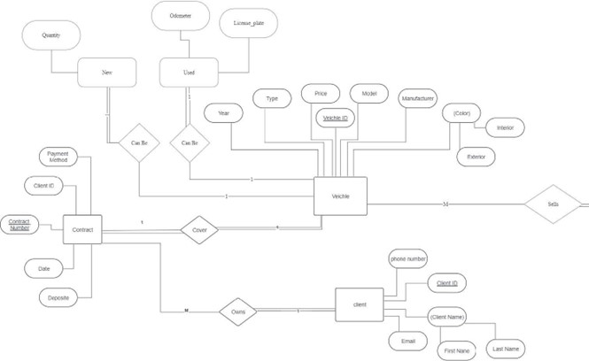
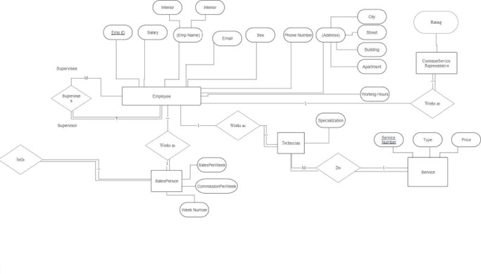
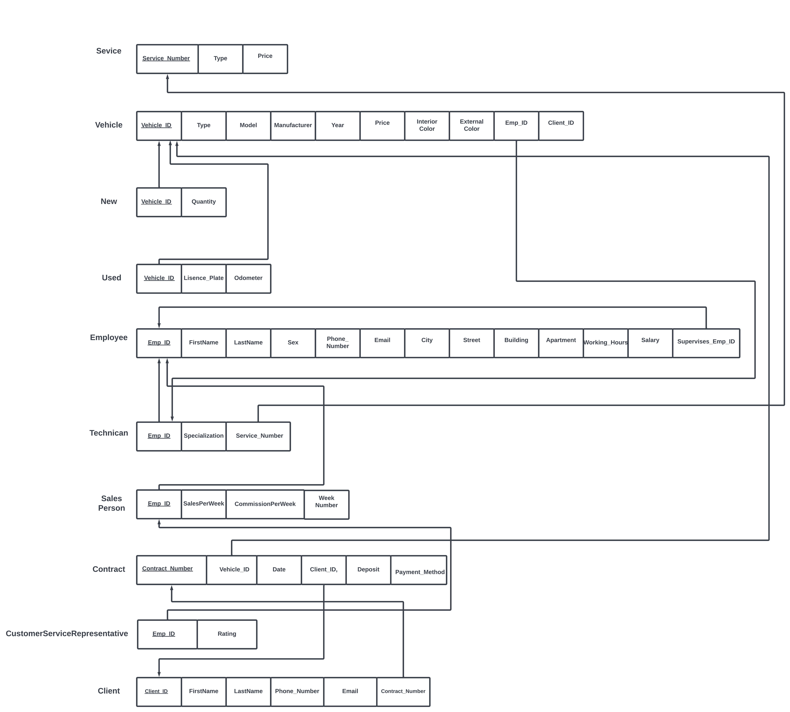

# Car Agency Database Project

## Table of Contents
1. [Introduction](#introduction)
2. [Entities Definition](#entities-definition)
3. [ER Diagram](#er-diagram)
4. [Relational Mapping](#relational-mapping)
5. [SQL](#sql)

## Introduction
Our database manages the data of a car agency. This car agency provides several services:
- Selling new cars
- Selling used cars
- Providing Repair Services

This database keeps the data of each individual car such as:
- Vehicle ID
- Car Model
- Car License Plate
- Price of the Car
- Color of the Car
- Manufacturer of the Car

It also stores the data of all the contracts made by the agency with the payment info and data about the customer. The database also has all the data related to the services it provides and the employees that work in the agency whether they were technicians or general employees.

## Entities Definition
The entity creation process and the data type of their data is shown in the table below:

| Entity   | Attributes                                                                                                            | Subclass                                                     |
|----------|-----------------------------------------------------------------------------------------------------------------------|--------------------------------------------------------------|
| Vehicle  | - Vehicle_ID<br>- Type<br>- Model<br>- Manufacturer<br>- Year<br>- Color (InteriorColor, ExteriorColor)<br>- Price   | New (Quantity)<br>Used (Licence_plate, Odometer)             |
| Employee | - Emp_ID<br>- Emp_Name (FirstName, LastName)<br>- Sex<br>- Phone_Number<br>- Email<br>- Address(City, Street, Building, Apartment)<br>- Working_Hours<br>- Salary | Technician (Specialization, Service_Number)<br>Salesperson(Sales, Commission)<br>Customer Service Representative (Rating) |
| Client   | - Client_ID<br>- Client_Name (FirstName, LastName)<br>- Phone_Number<br>- Email                                       |                                                              |
| Service  | - Service_Number<br>- Type<br>- Price                                                                                 |                                                              |
| Contract | - Contract_Number<br>- Vehicle_ID<br>- Date<br>- Client_ID<br>- Deposit<br>- Payment_Method                           |                                                              |

## ER Diagram



## Relational Mapping


## SQL
### Service Table:
```sql
CREATE TABLE Service (
    Service_Number int(11) NOT NULL,
    Type varchar(15) NOT NULL,
    Price int(11) NOT NULL,
    PRIMARY KEY (Service_Number)
);
```
### Vehicle Table:
```sql
CREATE TABLE Vehicle (
    Vehicle_ID int(11) NOT NULL,
    Type varchar(15) NOT NULL,
    Model varchar(15) NOT NULL,
    Manufacturer varchar(15) NOT NULL,
    Year int(4) NOT NULL,
    InteriorColor varchar(15) NOT NULL,
    ExteriorColor varchar(15) NOT NULL,
    Price int(11) NOT NULL,
    Emp_ID int(11) NOT NULL,
    PRIMARY KEY (Vehicle_ID),
    FOREIGN KEY (Emp_ID) REFERENCES Salesperson(Emp_ID)
);
```
### Employee Table:
```sql
CREATE TABLE Employee (
    Emp_ID int(11) NOT NULL,
    FirstName varchar(15) NOT NULL,
    LastName varchar(15) NOT NULL,
    Sex varchar(6) NOT NULL,
    Phone_Number int(11) NOT NULL,
    Email varchar(20) NOT NULL,
    City varchar(15) NOT NULL,
    Street varchar(15) NOT NULL,
    Building varchar(15) NOT NULL,
    Apartment int(3) NOT NULL,
    Working_Hours varchar(15) NOT NULL,
    Salary int(11) NOT NULL,
    Supervises_Emp_ID INT,
    PRIMARY KEY (Emp_ID),
    FOREIGN KEY (Supervises_Emp_ID) REFERENCES Employee(Emp_ID)
);
```
### Client Table:
```sql
CREATE TABLE Client (
    Client_ID int(11) NOT NULL,
    FirstName varchar(15) NOT NULL,
    LastName varchar(15) NOT NULL,
    Phone_Number int(11) NOT NULL,
    Email varchar(20) NOT NULL,
    Contract_Number int(11),
    PRIMARY KEY (Client_ID),
    FOREIGN KEY (Contract_Number) REFERENCES Contract(Contract_Number)
);
```
### Contract Table:
```sql
CREATE TABLE Contract (
    Contract_Number int(11) NOT NULL,
    Date date NOT NULL,
    Client_ID int(11) NOT NULL,
    Deposit int(11) NOT NULL,
    Payment_Method char(30) NOT NULL,
    Vehicle_ID int(11) NOT NULL,
    PRIMARY KEY (Contract_Number),
    FOREIGN KEY (Vehicle_ID) REFERENCES Vehicle(Vehicle_ID)
);
```
### Technician Table:
```sql
CREATE TABLE Technician (
    Specialization varchar(15) NOT NULL,
    Emp_ID int(11) NOT NULL,
    Service_Number int(11) NOT NULL,
    PRIMARY KEY (Emp_ID),
    FOREIGN KEY (Emp_ID) REFERENCES Employee(Emp_ID),
    FOREIGN KEY (Service_Number) REFERENCES Service(Service_Number)
);
```
### CustomerServiceRepresentative Table:
```sql
CREATE TABLE CustomerServiceRepresentative (
    Rating int(2) NOT NULL,
    Emp_ID int(11) NOT NULL,
    PRIMARY KEY (Emp_ID),
    FOREIGN KEY (Emp_ID) REFERENCES Employee(Emp_ID)
);
```
### Salesperson Table:
```sql
CREATE TABLE Salesperson (
    Week_Number int(2) NOT NULL,
    SalesPerWeek int(11),
    CommissionsPerWeek int(11),
    Emp_ID int(11) NOT NULL,
    PRIMARY KEY (Emp_ID),
    FOREIGN KEY (Emp_ID) REFERENCES Employee(Emp_ID)
);
```
### New Table:
```sql
CREATE TABLE New (
    Quantity int(11) NOT NULL,
    Vehicle_ID int(11) NOT NULL,
    PRIMARY KEY (Vehicle_ID),
    FOREIGN KEY (Vehicle_ID) REFERENCES Vehicle(Vehicle_ID)
);
```
### Used Table:
```sql
CREATE TABLE Used (
    License_Plate varchar(11) NOT NULL,
    Odometer int(11) NOT NULL,
    Vehicle_ID int(15) NOT NULL,
    PRIMARY KEY (Vehicle_ID),
    FOREIGN KEY (Vehicle_ID) REFERENCES Vehicle(Vehicle_ID)
);
```
